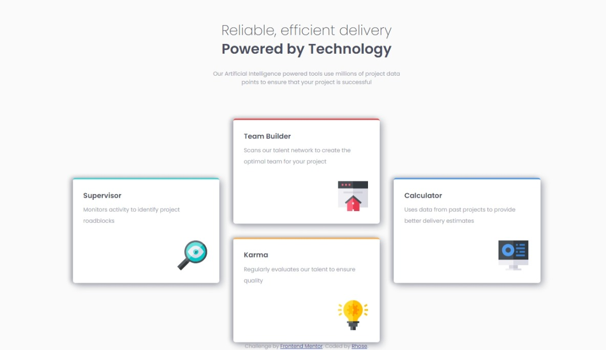

# Frontend Mentor - Four card feature section solution

This is a solution to the [Four card feature section challenge on Frontend Mentor](https://www.frontendmentor.io/challenges/four-card-feature-section-weK1eFYK). Frontend Mentor challenges help you improve your coding skills by building realistic projects. 

## Table of contents

- [Overview](#overview)
  - [The challenge](#the-challenge)
  - [Screenshot](#screenshot)
  - [Links](#links)
- [My process](#my-process)
  - [Built with](#built-with)
  - [What I learned](#what-i-learned)
  - [Continued development](#continued-development)
  - [Useful resources](#useful-resources)
- [Author](#author)
- [Acknowledgments](#acknowledgments)


## Overview

### The challenge

Users should be able to:

- View the optimal layout for the site depending on their device's screen size

### Screenshot




### Links

- Solution URL: [Add solution URL here](https://your-solution-url.com)
- Live Site URL: [Add live site URL here](https://658f34f67632d6f585eb6f10--dazzling-scone-7e7fc1.netlify.app/)

## My process

### Built with

- Semantic HTML5 markup
- CSS custom properties
- CSS Grid
- Mobile-first workflow
- [Font family](https://fonts.google.com/specimen/Poppins) - For styles

**Note: These are just examples. Delete this note and replace the list above with your own choices**

### What I learned

I learnt how to use CSS Grid and I learned how to use CSS @font-face Rule.

see code snippets below:


```css
@font-face {
    font-family: 'Poppins-SemiBold';
    src: url('Poppins/Poppins-SemiBold.ttf')
}
@font-face {
    font-family: 'Poppins-ExtraLight';
    src: url('Poppins/Poppins-ExtraLight.ttf')
}

@font-face {
    font-family: 'Poppins';
    src: url('Poppins/Poppins-Regular.ttf')
}
```


### Continued development

I will continue to focus on learning and applying CSS Grid and I want to get more comfortable with making responsive web designs


### Useful resources

- [Stackoverflow](https://stackoverflow.com/questions/15930003/downloading-a-google-font-and-setting-up-an-offline-site-that-uses-it) - This helped me in setting up a downloaded google font offline. I really liked this pattern and will use it going forward.
- [MDN WEB DOCS](https://developer.mozilla.org/en-US/docs/Web/CSS/CSS_grid_layout) - This is an amazing article which helped me understand CSS GRID. I'd recommend it to anyone still learning this concept.


## Author

- Frontend Mentor - [@rh0se](https://www.frontendmentor.io/profile/rh0se)
- Twitter - [@NerdySimi](https://twitter.com/NerdySimi)


## Acknowledgments
MYSELF

