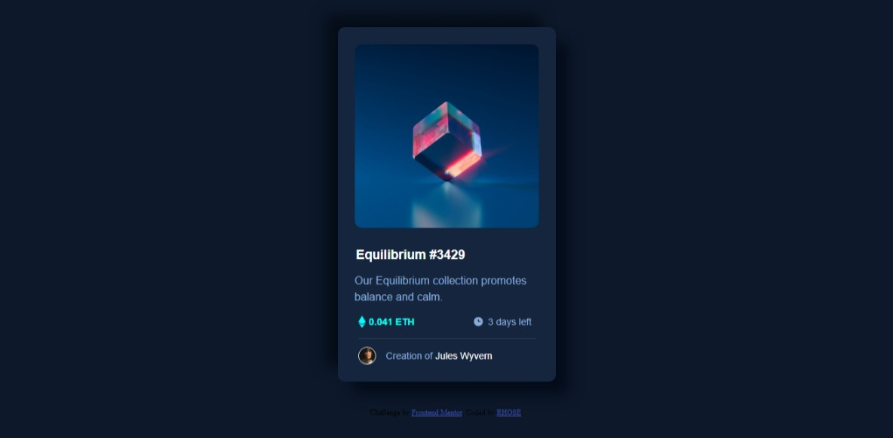

# Frontend Mentor - NFT preview card component solution

This is a solution to the [NFT preview card component challenge on Frontend Mentor](https://www.frontendmentor.io/challenges/nft-preview-card-component-SbdUL_w0U). Frontend Mentor challenges help you improve your coding skills by building realistic projects. 

## Table of contents

- [Overview](#overview)
  - [The challenge](#the-challenge)
  - [Screenshot](#screenshot)
  - [Links](#links)

  - [Built with](#built-with)
  - [What I learned](#what-i-learned)
  - [Useful resources](#useful-resources)
- [Author](#author)
- [Acknowledgments](#acknowledgments)


## Overview

### The challenge

Users should be able to:

- View the optimal layout depending on their device's screen size
- See hover states for interactive elements

### Screenshot




### Links

- Solution URL: [Add solution URL here](https://your-solution-url.com)
- Live Site URL: [Add live site URL here](https://your-live-site-url.com)


### Built with

- Semantic HTML5 markup
- CSS custom properties
- Flexbox
- Desktop first workflow


### What I learned

I learned how to create an transparent overlay on an image when the user hovers on the image.


To see how you can add code snippets, see below:


```css
.overlay:hover{
    
    background-color: rgba(0, 255, 247, 0.5);
    
}

```


If you want more help with writing markdown, we'd recommend checking out [The Markdown Guide](https://www.markdownguide.org/) to learn more.
*

### Useful resources

- [W3 Schools](https://www.w3schools.com/howto/howto_css_image_overlay_title.asp) - This helped me for the overlay effect. I really liked this pattern and will use it going forward.


## Author

- Frontend Mentor - [@rh0se](https://www.frontendmentor.io/profile/rh0se)
- Twitter - [@NerdySimi](https://twitter.com/NerdySimi)

**Note: Delete this note and add/remove/edit lines above based on what links you'd like to share.**

## Acknowledgments
 I would like to thank Nonso Nwabuokei for his guidance.

