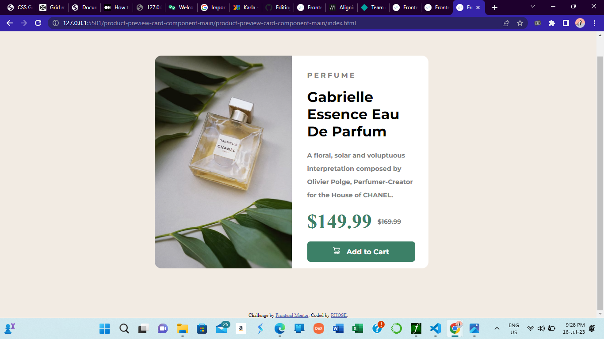

# Frontend Mentor - Product preview card component solution

This is a solution to the [Product preview card component challenge on Frontend Mentor](https://www.frontendmentor.io/challenges/product-preview-card-component-GO7UmttRfa).
This was the first ever challenge i completed on frontend mentor.
 Frontend Mentor challenges help you improve your coding skills by building realistic projects. 

## Table of contents

- [Overview](#overview)
  - [The challenge](#the-challenge)
  - [Screenshot](#screenshot)
  - [Links](#links)
- [My process](#my-process)
  - [Built with](#built-with)
  - [What I learned](#what-i-learned)
  - [Continued development](#continued-development)
  - [Useful resources](#useful-resources)
- [Author](#author)
- [Acknowledgments](#acknowledgments)

## Overview

### The challenge

Users should be able to:

- View the optimal layout depending on their device's screen size
- See hover and focus states for interactive elements

### Screenshot

### Links

- Solution URL: [Add solution URL here](https://your-solution-url.com)
- Live Site URL: [Add live site URL here](https://your-live-site-url.com)

## My process

### Built with

- Semantic HTML5 markup
- CSS custom properties
- Flexbox
- Desktop-first workflow

- Family: [Montserrat](https://fonts.google.com/specimen/Montserrat)
- Weights: 500, 700

- Family: [Fraunces](https://fonts.google.com/specimen/Fraunces)
- Weights: 700

### What I learned

I learned how to implement flexbox to create responsive designs.

### Continued development
i need to develop my skills in centering a div and creating more responsive designs with flexbox

### Useful resources

- [MDN web docs](https://developer.mozilla.org/en-US/docs/Web/CSS/CSS_flexible_box_layout/Basic_concepts_of_flexbox) 

## Author

- Frontend Mentor - [@rh0se](https://www.frontendmentor.io/profile/rh0se)
- Twitter - [@NerdySimi](https://twitter.com/NerdySimi)

## Acknowledgments

Myself
